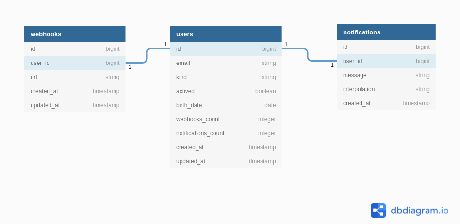

# Teste Dev Jr

Implementar um broadcast http, onde um usuário cadastra vários webhooks com url de destino, para estas urls receberem a mesma mensagem de cada notificação cadastrada. Disponibilizar telas simples em html para listagem, edição, cadastro e exclusão de dados. Disponibilizar uma API RESTful simples para cadastrar notificações.



## Orientações importantes
- O teste pode ser concluído até "10/02/2022 23:59:59". São 5 dias úteis a partir de "04/02/2022 00:00:00".
- Enviar e-mail para "marcelo.junior@meuposto.app" avisando sobre conclusão do teste, por favor.
- Escolha a linguagem e framework web que você tiver mais habilidade.
- Não se preocupe com css ou componentes js. Precisa ter apenas telas simples em html para enviar e receber os dados. Escolha o que for mais produtivo para você.
- Implemente o código fonte em inglês. Os textos, labels, títulos e mensagens exibidas podem ser em português. 
- Mensagens e quantidade de commits são livres.
- Use as convenções do seu framework web sempre que possível.
- Siga a ordem das entregas. 
- Se tiver muita dificuldade para entregar algo, ou ainda não souber como fazer, passe para próxima etapa.
- Tente entreguar bem feito o que for possível, mesmo que não entregue tudo.

## Entregas obrigatórias

### 1ª entregas
- Criar branch **setup** com base na **master** e fazer commits quando achar necessário.
- Escolher algum framework web em qualquer linguagem.
- Escolher algum banco de dados relacional.
- Descrever no final desse README.md o nome e versão das linguagens, frameworks e banco de dados.
- Implementar o setup do projeto para subir o servidor em localhost.
- Abrir pull request da branch **setup** para a **master**, em seguida fazer um review para conferir se faltou algo, finalmente fazer o merge do pull request na **master**.

### 2ª entrega
- Criar branch **users** com base na **master** e fazer commits quando achar necessário.
- Criar CRUD para **user**. Com telas em html simples para listar, editar, cadastrar e excluir. Não precisa aplicar css.
- Listar todos os campos.
- Cadastrar e editar somente: email, kind, actived, birth_date.
- Exibir os erros dos campos ao cadastrar e editar via formulário.
- Implementas validações dos campos no modelos.
- Implementar validações dos campos no banco de dados quando possível.
- Seguir a convenção do seu frameword web.
- Aplicar testes unitários nos modelos.
- Abrir pull request da branch **users** para a **master**, em seguida fazer um review para conferir se faltou algo, finalmente fazer o merge do pull request na **master**.

Modelagem
```yml
tabela: users
  campo: id
    tipo: bigint ou equivalente do seu framework web para ids.
  campo: email
    tipo: string ou equivalente do seu fw web para textos curtos.
    regras: obrigatório e único.
  campo: kind
    tipo: string ou integer ou equivalente do seu fw web para enums.
    regras: obrigatório
  campo: actived
    tipo: boolean ou equivalente do seu fw web para valores lógicos.
    regras: obrigatório e valor inicial é false.
  campo: birth_date
    tipo: date ou equivalente do seu fw web para datas sem hora.
    regras: opcional
  campo: webhooks_count
    tipo: integer ou equivalente do seu fw web para inteiros.
    regras: obrigatório e valor inicial é 0.
  campo: notifications_count
    tipo: integer ou equivalente do seu fw web para inteiros.
    regras: obrigatório e valor inicial é 0.
  campo: created_at
    tipo: timestamp ou equivalente do seu fw web para data e hora.
    regras: obrigatório, referente a data de cadastro e gerenciado pelo fw web.
  campo: updated_at
    tipo: timestamp ou equivalente do seu fw web para data e hora.
    regras: obrigatório, referente a data de cadastro ou última edição e gerenciado pelo fw web.
```

### 3ª Entrega
- Criar branch **webhooks** com base na **master** e fazer commits quando achar necessário.
- Criar CRUD para **webhook**. Com telas em html simples para listar, editar, cadastrar e excluir. Não precisa aplicar css.
- Listar todos os campos.
- Cadastrar e editar somente: user, url.
- Adicionar +1 no **users.webhooks_count** ao cadastrar um **webhook**. Usar solução nativa do framework web se existir.
- Remover -1 no **users.webhooks_count** ao excluir um **webhook**. Usar solução nativa do framework web se existir.
- Refatorar o modelo **user** para não excluir, quando existirem **webhooks** cadastrados nele. Usar solução nativa do framework web se existir.
- Refatorar o modelo **user** para exibir erro ao excluir, quando tiver algum **webhook** cadastrado.
- Exibir os erros dos campos ao cadastrar e editar via formulário.
- Implementas validações dos campos no modelos;
- Implementar validações dos campos no banco de dados quando possível;
- Seguir a convenção do seu frameword web.
- Aplicar testes unitários nos modelos.
- Abrir pull request da branch **webhooks** para a **master**, em seguida fazer um review para conferir se faltou algo, finalmente fazer o merge do pull request na **master**.

Modelagem
```yml
tabela: webhooks
  campo: id
    tipo: bigint ou equivalente do seu framework web para ids.
  campo: user_id
    tipo: foreign key para "users.id".
    regras: obrigatório
  campo: url
    tipo: string ou equivalente do seu fw web para textos curtos.
    regras: obrigatório, único por user, não deve aceitar a mesma url no mesmo user.
  campo: created_at
    tipo: timestamp ou equivalente do seu fw web para data e hora.
    regras: obrigatório, referente a data de cadastro e gerenciado pelo fw web.
  campo: updated_at
    tipo: timestamp ou equivalente do seu fw web para data e hora.
    regras: obrigatório, referente a data de cadastro ou última edição e gerenciado pelo fw web.
```

### 4ª Entrega
- Criar branch **notifications** com base na **master** e fazer commits quando achar necessário.
- Criar CRUD para **notification**. Com telas em html simples para listar, cadastrar e excluir. Não precisa aplicar css. Não tem edição.
- Adicionar +1 no **users.notifications_count** ao cadastrar um **notification**. Usar solução nativa do framework web se existir.
- Remover -1 no **users.notifications_count** ao excluir um **notification**. Usar solução nativa do framework web se existir.
- Refatorar o modelo **user** para não excluir, quando existirem **notifications** cadastrados nele. Usar solução nativa do framework web se existir.
- Refatorar o modelo **user** para exibir erro ao excluir, quando tiver algum **notification** cadastrado.
- Exibir os erros dos campos ao cadastrar via formulário.
- Implementas validações dos campos no modelos;
- Implementar validações dos campos no banco de dados quando possível;
- Seguir a convenção do seu frameword web.
- Aplicar teste unitários nos modelos.
- Abrir pull request da branch **notifications** para a **master**, em seguida fazer um review para conferir se faltou algo, finalmente fazer o merge do pull request na **master**.

Modelagem
```yml
tabela: notifications
  campo: id
    tipo: bigint ou equivalente do seu framework web para ids.
  campo: user_id
    tipo: foreign key para "users.id".
    regras: obrigatório
  campo: message
    tipo: string ou equivalente do seu fw web para textos curtos.
    regras: obrigatório e deve aceitar interpolação das key (user_email e database_current_timestemp), entre chaves duplas "{{key}}" em qualquer parte do texto.
    user_email: deve interporlar com o email do user da notification.
    database_current_timestemp: !
      Deve interporlar com a data hora do banco de dados formatada em "DD/MM/YYYY hh:mm:ss". 
      A data hora precisa vir do banco de dados. A formatação pode ser no feita pelo fw. 
  campo: interpolation
    tipo: string ou equivalente do seu fw web para textos curtos.
    regras: !
      Obrigatório e deve ser o resultado da interpolação do campo "message". Tente implementar um algoritmo para interpolar.
      Ex.: 
        Supondo que message seja: "Olá {{user_email}}! Foi cadastrada uma nova notificação em {{database_current_timestemp}}.". 
        O resultado deve ser: "Olá user@email.com! Foi cadastrada uma nova notificação em 01/01/2022 00:00:00."
  campo: created_at
    tipo: timestamp ou equivalente do seu fw web para data e hora.
    regras: obrigatório, referente a data de cadastro e gerenciado pelo fw web.
```

### Entrega final
- Criar branch **api_notifications** com base na **master** e fazer commits quando achar necessário.
- Criar API RESTful pública para casdastrar **notifications**, sem necessidade de passar um **token** ou **api_key**. 
- Exibir os erros dos campos ao cadastrar via api.
- Seguir a convenção do seu frameword web.
- A request deve entender payload json nesse formato:
- Abrir pull request da branch **api_notifications** para a **master**, em seguida fazer um review para conferir se faltou algo, finalmente fazer o merge do pull request na **master**.
```json
  { "user": {"id": 1}, "message": "Olá {{user_email}}! Foi cadastrada uma nova notificação em {{notification_created_at}}." }
```
- A response de sucesso deve ser um json nesse formato:
```json
  { "notificaiton": {"id": "1", "user": {"id": 1, "email": "user@email.com"}, "message": "Olá {{user_email}}! Foi cadastrada uma nova notificação em {{notification_created_at}}.", "created_at": "2022-01-01T00:00:00" } }
```
- A response de erro deve ser um json nesse formato:
```json
  { "erros": {"user": "error", "message": "error" } }
```

### Entrega Bônus - Opcional
- Criar branch **deliver_webhooks** com base na **master** e fazer commits quando achar necessário.
- Disparar de forma assíncrona uma request **http**, para a **url** de cada **webhook** do **user** envolvido num novo cadastro de **notification**. Tanto no cadastro de **notification** via API, quanto via formulário html;
- Aplicar testes nos demais componentes implementados;
- Abrir pull request da branch **deliver_webhooks** para a **master**, em seguida fazer um review para conferir se faltou algo, finalmente fazer o merge do pull request na **master**.


### Tecnologias usadas no projeto

- TypeScript - "typescript": "^4.5.5"

- TypeORM -  "typeorm": "^0.2.41"

- Express.JS - "express": "^4.17.2"

- class-validator - "class-validator": "^0.13.2"

- msQL - "mysql": "^2.18.1"

- UUID - "uuid": "^8.3.2"